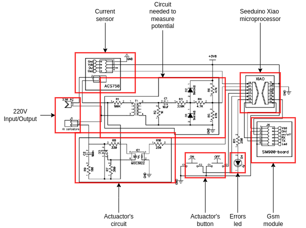
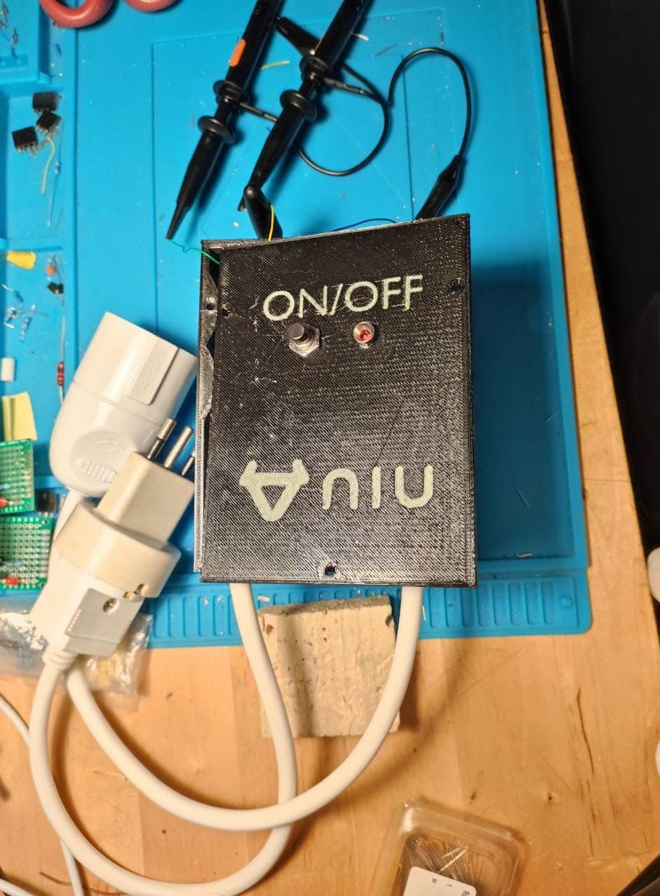
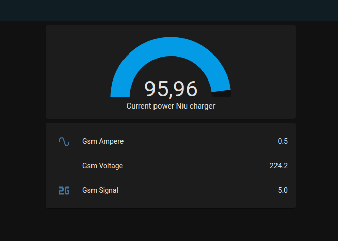

# Final project of Internet of thing course
## A real IOT device to keep trace of the e-scooter charging
### Repository for the delivery of the final project of the Internet of Things course

<!--  -->

This repository is divided in:

* Project Architecture slides 
	- into the folder "slide" or [here]()

* Project video presentation 
	- into the folder "video" or [here]()

* Project sources ("src" folder or [here]())
	- `circuitpython_sources`
		- contains the sources for the Circuitpython program to:
			- get data from the sensors
			- upload them into the python server
			- to automatically close the actuator when the instantaneous consumes are lower than a threshold

	- `middleware_server_sources`
			
		- contains the sources for the python Flask web server which acts as a middleware server.
		Here the IOT device updates the charging sensors data

		- offers:

			- GET method to reply database's server
			- POST method to save the data to the server, using the json:

					{
						"msg" : 
							[
								{
									"amper" : 1239,
									"data" : "22/04/05,11:39:33",
									"signal" : 10, 
									"volt" : 2330
								},
							]
					}
				- Where:
					- "amper" is the current current value
					- "data" is the datetime from SIM800's NTP
					- "signal" is the current GSM signal value
					- "volt" is the current voltage (V/10) value

			

	- `iot_gsm_device`
		- contains the sources for the Home assistant integration.
		- To install this integration:
			<!-- - Add middleware server link to the integration sources -->
			- Install Home Assistant via [link](https://www.home-assistant.io/installation/)
			- copy the folder `iot_gsm_device` it into the Home Assistant config folder `[Home_Assistant_config_dir]/custom_components/`,
			the default Home Assistant config folder is:  `~/.homeassistant/`
			- Add this integration to the installed integrations in Home Assistant using the UI	
			
			

