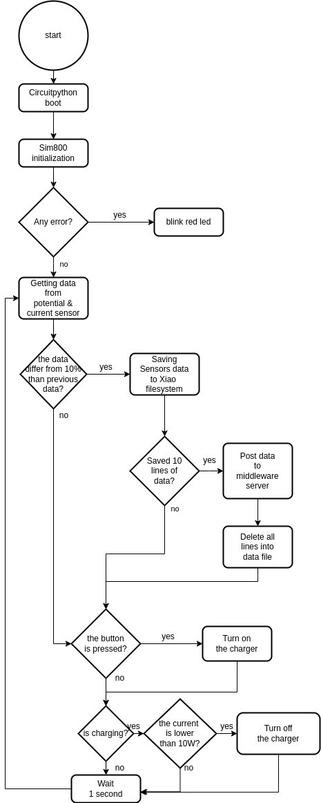

# Circuitpython sources for GSM IOT device

## Description:
Main program to control the Seeduino Xiao to collect the data on the GSM IOT device.
Executing the `main_app.py` file the microprocessor initializes the board, the SIM800 GSM module then it enters into an infinite loop where it gets data from the sensors, checks if the data differ enough.
If the data are enough differ than the previous and there are enough data into the microprocessor's filesystem all the collected data are sent to the middleware server.
In the case the charger is enabled, via push button, the instantaneous current consumes are lower than a threshold the charger is automatically turned off.